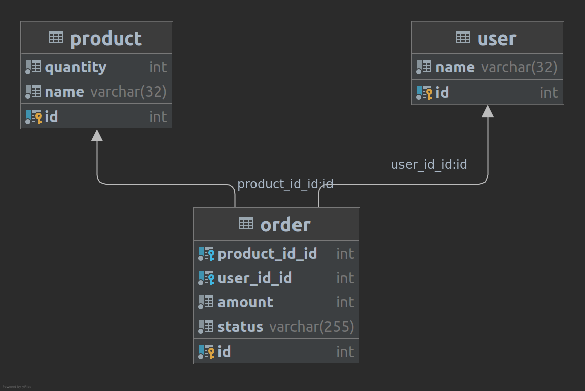

# Prueba tecnica IPGLOBAL
## ejercicio
Se trata de una simulacion de Tienda en la que se genera un mensaje para la creacion de un 
pedido. Dicho pedido puede tardar en procesarse (debido a ciertos calculos), por lo que es 
necesario separar la application con un consumidor y una gestion de mensajes con rabbitmq.

El enunciado de la práctica esta [aqui](docs/3_PRUEBA.md).

## Solucion con DDD
La solución aquí planteada trata de simular en tres apartados la tienda descrita anteriormente.
En dichos apartados (bounded-context) están separadas las logicas DDD correspondientes. Para no 
complicar mucho la anidación de los directorios, he optado por esta estructura:
```
src/
├── Backend
│   └── OrderConsumer
│       └── Application
├── Shared
│   ├── Application
│   ├── Domain
│   └── Infrastructure
│       └── Entity
└── Shop
    └── OrderProducer
        ├── Application
        ├── Domain
        └── Infrastructure
```

## instalacion
Esta basada en el uso de contenedores docker y comandos Make. 

Podemos seguir el proceso de instalacion [aqui](docs/1_INSTALACION.md)

Los comandos make utilizados se pueden ver [aqui](docs/4_MAKEFILE.md)

## Base de datos

despues de ejecutar el comando
```
make init-database
```
se crea el schema anterior y se añaden unos cuantos valores a las tablas de product y user.

### Product

| id | name | amount |
 |----|------|--------| 
|  1 | ipad | 0 |
| 2 | pc | 10 |
| 3 | blackberry | 4 |
| 4 | nokia | 6 |
| 5 | android | 80 |

### User
| id | name  |
 |----|------| 
|  1 | jesus |
| 2 | marcos |
| 3 | pablo  |
| 4 | jose   |

Estos seran los ids que podamos utilizar.
## Ejecución de comando
```
make create-order userId={int} productId={int} amount={int}
```
Esto intentara crear un order con el user, product y amount requeridos.

para la peticion:
```
make create-order userId=1 productId=1 amount=1
```

nos da una linea como:
```
order: "647718" quantity '1' not available for product '1'
```
podemos llegar a ver una tabla como esta:

|id|product_id_id|user_id_id|amount|status|
|--|--|--|--|--|
|1635|3|1|3|REJECTED|
|471461|3|1|3|APPROVED|
|844841|4|1|3|APPROVED|

si queremos ver que sucede, podemos ver un log del consumer:
```
$ docker logs api_consumer -f

 [OK] Consuming messages from transport "async".                                

 // The worker will automatically exit once it has received a stop signal via   
 // the messenger:stop-workers command.                                         

 // Quit the worker with CONTROL-C.                                             

 // Re-run the command with a -vv option to see logs about consumed messages.   

order: "647718" quantity '3' not available for product '2
order: "66373" quantity '3' not available for product '2
```

## Mejoras
 - aumentar cobertura de tests
 - forzar el arranque del consumidor DESPUES de rabbitmq